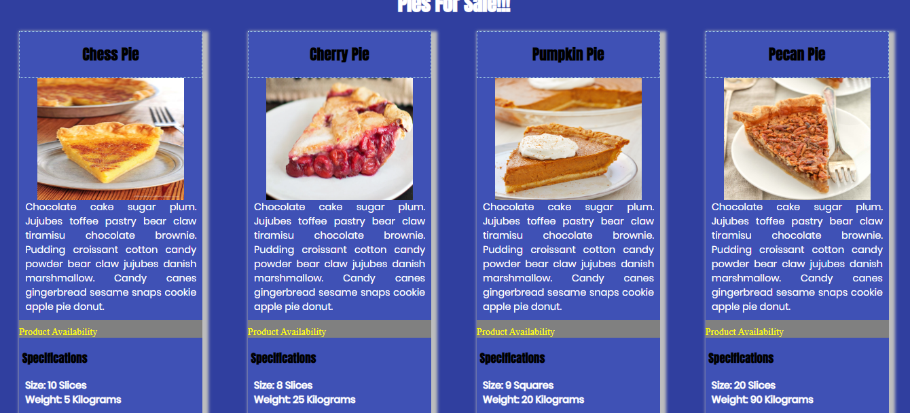

# product-cards

## Description
In the project we explored making cards using just HTML and CSS. We learned the beginings of flexbox. Everything was hard coded into the HTML and CSS.

## Screenshots

## How to run
1. Clone down this repo
1. Make sure you have http-server installed via npm. If not get it HERE.
1. In your command line run `hs -p 9999`
1. In your browser go to to `http://localhost:9999`
